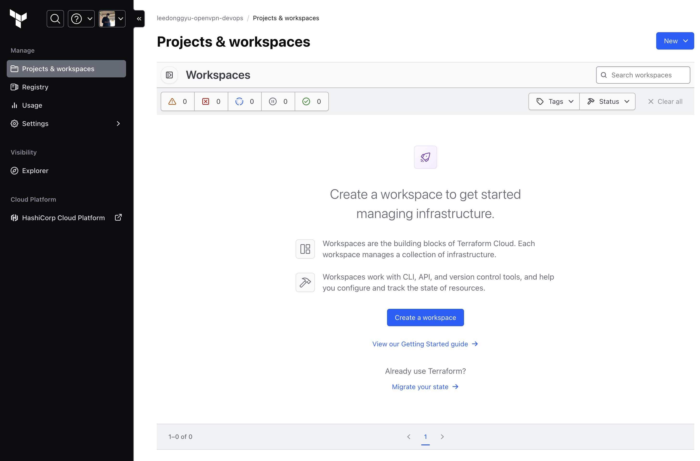
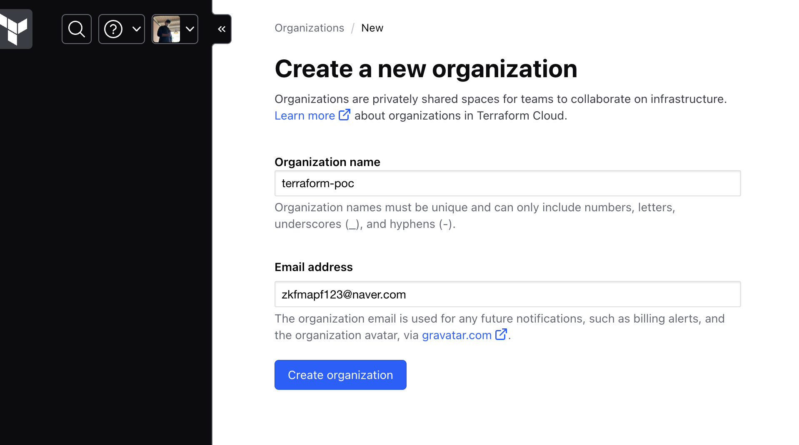
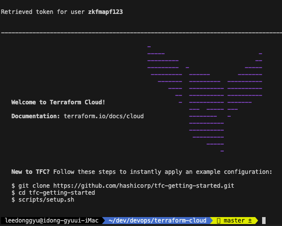
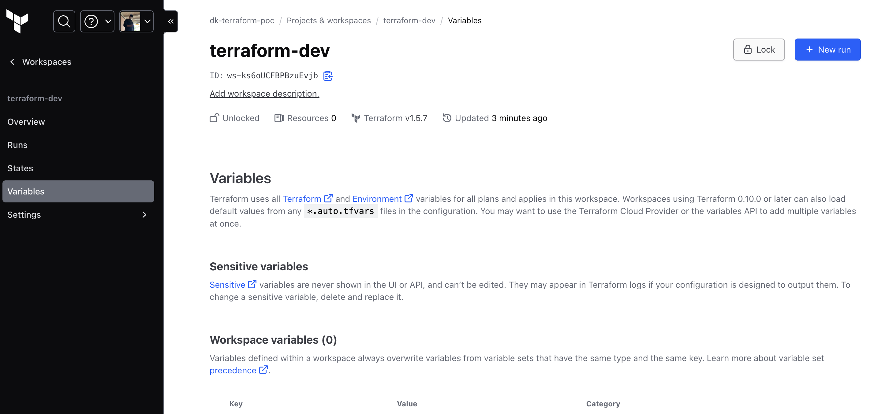
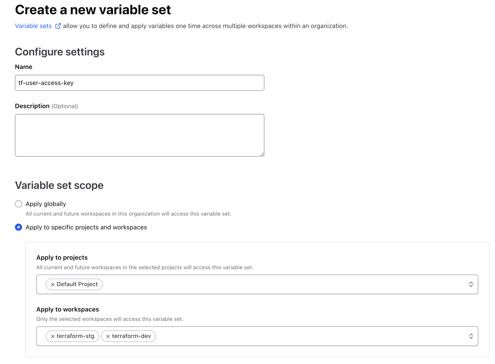
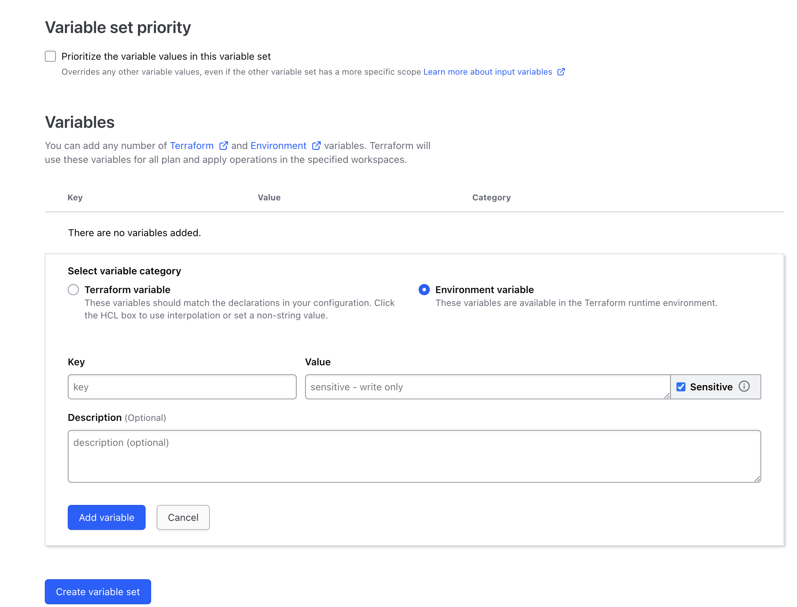
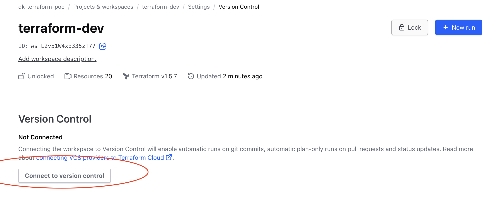
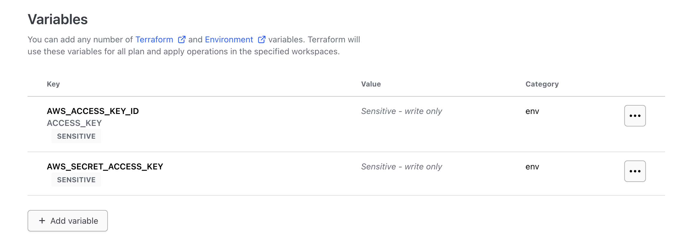

# Terraform Cloud PoC

## Props

- Terraform State
- Local이 아닌 Apply 해서 반영을 진행해줌
- Local에서는 코드만 수정하면 됨...

## ...

1. Git Repository 구성 & Repository Push

2. Create a workspace in Terraform Cloud





3. terraform login

```
terraform login
.. 구성 후
terraform init
```

```terraform
terraform {
  required_providers {

    aws = {
      source  = "hashicorp/aws"
      version = "4.48.0"
    }
  }

  cloud {
    hostname     = "app.terraform.io" ## Fixed
    organization = "dk-terraform-poc" ## Organization Name

    ## Default Workspace
    workspaces {
      tags = ["dev"]
      name = "terraform-dev"
    }
  }
}
```

4. AWS Key 등록 (이건 약간 허들...)

- AWS Resource를 바꾸는 거다 보니까... AccessKey, SecretKey가 필요하다





5. 최초로 한번만 apply 해야함 (이것도 좀...)

```
terrform apply
```

6. Git에 Push 하면 Terraform cloud에 반영되게 하기

- Workspace > Setting > Version Control > Version Control Workflow




## Issue

```
  Not Found Profile...
```

- provider를 설정할때 원래 accessKey, secretKey 옵션이 존재하는데
- 이걸 variable set에서 설정해줘야 함...



## Reference 

- <a href="https://www.toptal.com/developers/gitignore/"> gitignore.io </a>
- <a href="https://www.hashicorp.com/products/terraform"> Terraform Cloud </a>
- <a href="https://developer.hashicorp.com/terraform/tutorials/cloud/migrate-remote-s3-backend-tfc"> migrate s3 to terraform cloud </a>